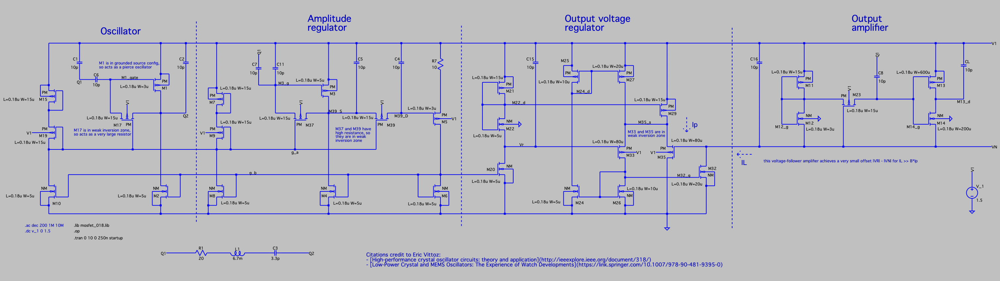
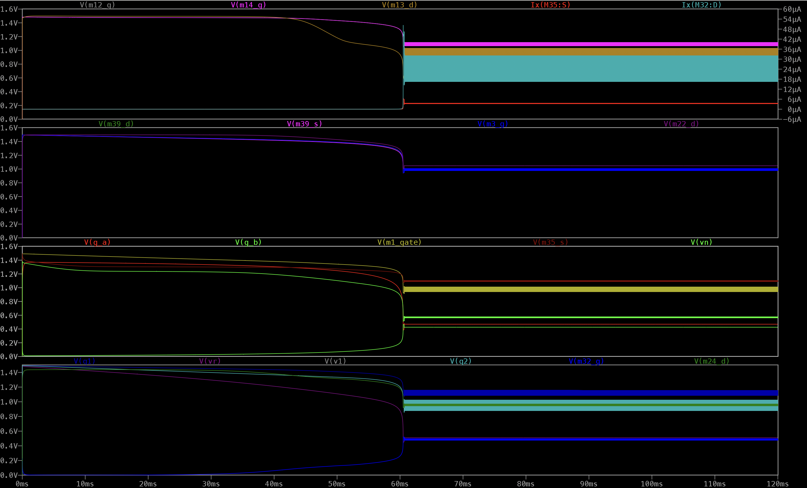
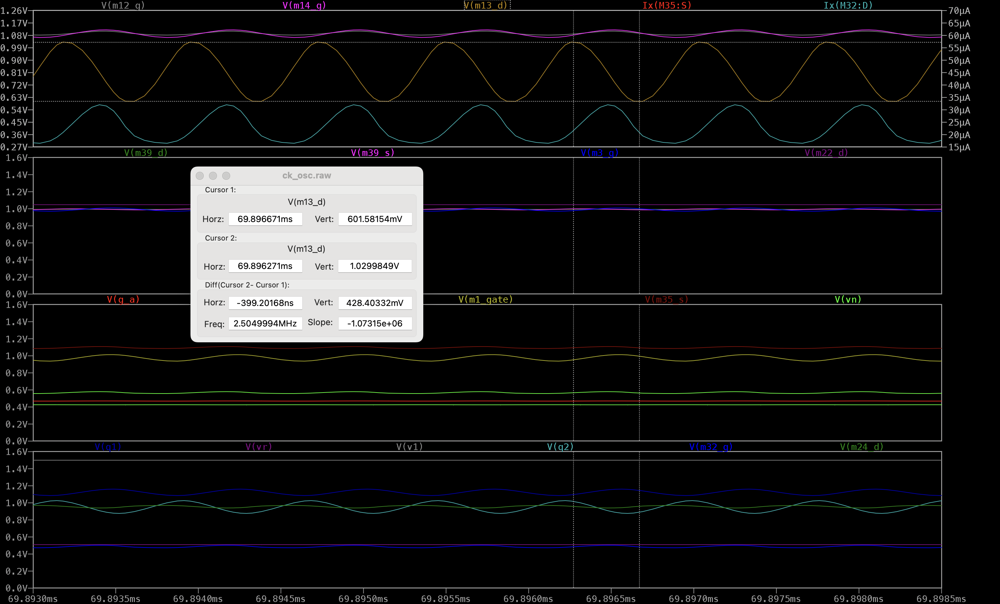

# ck_osc
A simple implementation of a crystal oscillator circuit

Citations credit to Eric Vittoz:
- [High-performance crystal oscillator circuits: theory and application](http://ieeexplore.ieee.org/document/318/)
- [Low-Power Crystal and MEMS Oscillators: The Experience of Watch Developments](https://link.springer.com/10.1007/978-90-481-9395-0)
